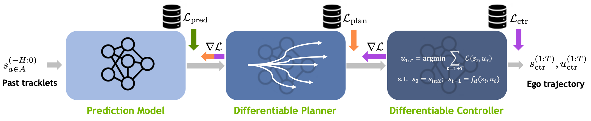

[](https://github.com/NVlabs/diffstack/blob/main/LICENSE.txt)


# DiffStack



This repository contains the code for [DiffStack: A Differentiable and Modular Control Stack for Autonomous Vehicles](https://openreview.net/forum?id=teEnA3L4aRe) a CoRL 2022 paper by Peter Karkus, Boris Ivanovic, Shie Mannor, Marco Pavone.

DiffStack is comprised of differentiable modules for prediction, planning, and control.
Importantly, this means that gradients can propagate backwards all the way from the final planning
objective, allowing upstream predictions to be optimized with respect to downstream decision making.

**Disclaimer** this code if for research purpose only. This is only an alpha release, not product quality code. Expect some rough edges and sparse documentation.

**Credits:** the code is built on [Trajectron++](https://github.com/StanfordASL/Trajectron-plus-plus), [Differentiable MPC](https://github.com/locuslab/mpc.pytorch), [Unified Trajctory Data Loader](https://github.com/NVlabs/trajdata), and we utilize several other standard libraries.

## Setup

### Install

Create a conda or virtualenv environment and clone the repository

```bash
conda create -n diffstack python==3.9
conda activate diffstack
git clone https://github.com/NVlabs/diffstack
```

Install diffstack (locally) with pip

```bash
cd diffstack
pip install -e ./
```

This single step is sufficient to install all dependencies. For active development, you may prefer to clone and install [Trajectron++](https://github.com/StanfordASL/Trajectron-plus-plu), [Differentiable MPC](https://github.com/locuslab/mpc.pytorch), and [Unified Trajctory Data Loader](https://github.com/NVlabs/trajdata) manually.


### Prepare data

Download and setup the NuScenes dataset following [https://github.com/NVlabs/trajdata/blob/main/DATASETS.md](https://github.com/NVlabs/trajdata/blob/main/DATASETS.md)

The path to the dataset can be specified with the `--data_loc_dict` argument, the default is `--data_loc_dict={\"nusc_mini\": \"./data/nuscenes\"}`

## Usage

We currently support training and evaluation from two data sources.

- Cached data source (`--data_source=cache`) corresponds to a custom preprocessed dataset that allows reproducing results in the paper.
- Trajdata source (`--data_source=trajdata`) is an interface to the [Unified Trajectory Data Loader](https://github.com/NVlabs/trajdata) that supports various data sources including nuScenes, Lyft, etc. This is the recommended way to train new models.

We provide a couple of example commands below. For more argument options use `python ./diffstack/train.py --help` or look at [./diffstack/argument_parser.py](diffstack/argument_parser.py).


### Training a new model

To train a new model we recommend using the `trajdata` data source and the following default arguments. See [Unified Trajectory Data Loader](https://github.com/NVlabs/trajdata) for setting up different datasets.

An example for data-parallel training on the nuScenes mini dataset using 1 gpu. Remember to change the path to the dataset. Use the full training set instead of minival for meaningful results.

```bash
python -m torch.distributed.run --nproc_per_node=1 ./diffstack/train.py \
                --data_loc_dict={\"nusc_mini\": \"./data/nuscenes\"} \
                --train_data=nusc_mini-mini_train \
                --eval_data=nusc_mini-mini_val \
                --predictor=tpp \
                --plan_cost=corl_default_angle_fix \
                --plan_loss_scaler=100 \
                --plan_loss_scaler2=10 \
                --device=cuda:0
```

### Reproducing published results

To reporduce results you will need to download our preprocessed dataset ([nuScenes-minival](https://drive.google.com/drive/folders/1jhxNQMWCkVpdDUhAuvYZ2rihT67j77o0?usp=share_link), [nuScenes-full](https://drive.google.com/drive/folders/1xq7OJG5k796_SFsb6j6g7O2e5kc85z51?usp=share_link)) and optionally the pretrained models ([checkpoints](https://drive.google.com/drive/folders/18X4i_gsj72kBkpMGT6Psp3svaqR6yU8d?usp=sharing)). Please only use the dataset and models if you have agreed to the terms for non-commercial use on [https://www.nuscenes.org/nuscenes](https://www.nuscenes.org/nuscenes). The preprocessed dataset and pretrained models are under the [CC BY-NC-SA 4.0 licence](https://creativecommons.org/licenses/by-nc-sa/4.0/legalcode). 

Evaluate a pretrained DiffStack model with jointly trained prediction-planning-control modules on the nuscenes minival dataset. Remember to update the path to the downloaded data and models. Use the full validation set to reproduce results in the paper.

```bash
python ./diffstack/train.py \
                --data_source=cache \
                --cached_data_dir=./data/cached_data/ \
                --data_loc_dict={\"nusc_mini\": \"./data/nuscenes\"} \
                --train_data=nusc_mini-mini_train \
                --eval_data=nusc_mini-mini_val \
                --predictor=tpp_cache \
                --dynamic_edges=yes \
                --plan_cost=corl_default \
                --train_epochs=0 \
                --load=./data/pretrained_models/diffstack_model.pt
```

Retrain a DiffStack model (on cpu) using our preprocessed dataset.  Remember to update the path to the downloaded data. When training a new model you should expect semantically similar results as in the paper, but exact reproduction is not possible due to different random seeding of the public code base.

```bash
python ./diffstack/train.py \
                --data_source=cache \
                --cached_data_dir=./data/cached_data/ \
                --data_loc_dict={\"nusc_mini\": \"./data/nuscenes\"} \
                --train_data=nusc_mini-mini_train \
                --eval_data=nusc_mini-mini_val \
                --predictor=tpp_cache \
                --dynamic_edges=yes \
                --plan_cost=corl_default \
                --plan_loss_scaler=100 
```

To use 1 gpu and distributed data parallel pipeline use:

```bash
python -m torch.distributed.run --nproc_per_node=1 ./diffstack/train.py \
                --data_source=cache \
                --cached_data_dir=./data/cached_data/ \
                --data_loc_dict={\"nusc_mini\": \"./data/nuscenes\"} \
                --train_data=nusc_mini-mini_train \
                --eval_data=nusc_mini-mini_val \
                --predictor=tpp_cache \
                --dynamic_edges=yes \
                --plan_cost=corl_default \
                --plan_loss_scaler=100 \
                --device=cuda:0
```

Train a standard stack that only trains for a prediction objective by setting `--plan_loss_scaler=0`:

```bash
python -m torch.distributed.run --nproc_per_node=1 ./diffstack/train.py \
                --data_source=cache \
                --cached_data_dir=./data/cached_data/ \
                --data_loc_dict={\"nusc_mini\": \"./data/nuscenes\"} \
                --train_data=nusc_mini-mini_train \
                --eval_data=nusc_mini-mini_val \
                --predictor=tpp_cache \
                --dynamic_edges=yes \
                --plan_cost=corl_default \
                --plan_loss_scaler=0 
                --device=cuda:0
```

## Licence

The source code is released under the [NSCL licence](https://github.com/NVlabs/diffstack/blob/main/LICENSE.txt). The preprocessed dataset and pretrained models are under the [CC BY-NC-SA 4.0 licence](https://creativecommons.org/licenses/by-nc-sa/4.0/legalcode).
